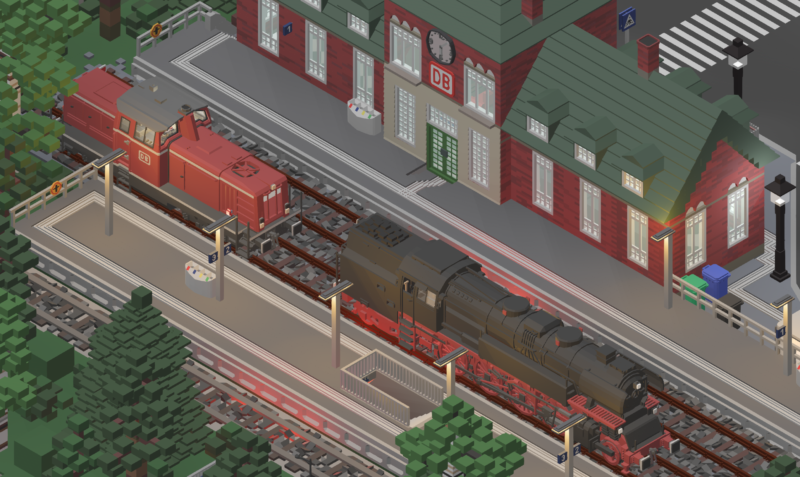
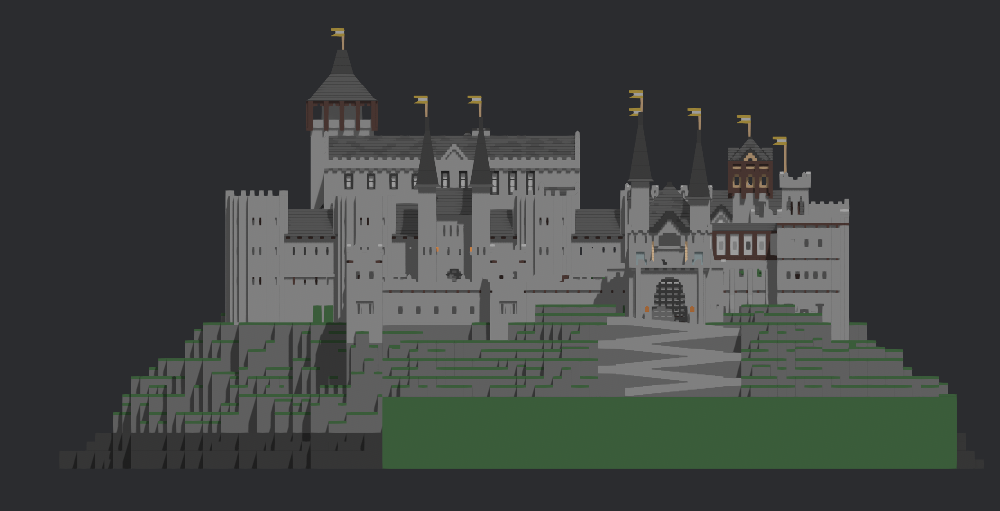

# BRS Iso

An isometric-style viewer for Brickadia saves, made with the Bevy game engine






## Motivation
Brickadia is made in Unreal engine, which does not have support for orthographic camera rendering that is not aligned to a major axis, so isometric views are not possible

## Goals:
- better mesh optimization (coverage + planar reduction)
- better camera movement
- hologram material

## Controls:
```
L - load a save
WASD - move camera (hold shift to speed up)
Q/E - rotate camera (hold shift to speed up)
Left/Right Arrow Keys - rotate sunlight
F2 - take a screenshot
H - teleport to center of build volume

Press "/" to open command console:
/clearbricks - clear all bricks/components
/water - toggle water (can be raised/lowered with I/K)
/ground - toggle ground plane
/shadows - toggle shadows
/debuglights - toggle light gizmos
```
